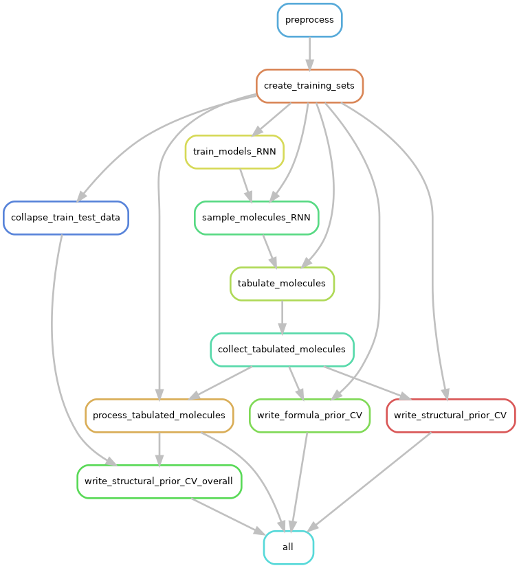

## Snakemake workflow

The included `Snakefile` provides a way to run the end-end workflow for the
`NPS-generation` repository.

The following "rulegraph" illustrates the unique steps in the workflow that would be run,
and their order of execution.



Note that the actual number of jobs will exceed the number of rules above, since many different
instances of the rules will be run for any given dataset, depending on the number of train/test folds,
the number of independent seeds against which to run the models etc.

The following dependency graph illustrates the particular instances of the steps that would be run, when
running the workflow for 3 folds and 2 seeds (This is the starter configuration provided in the file `config_fast.json`).


### Testing the workflow

To run this workflow on the LOTUS dataset:

#### Steps

1. Install `NPS-generation` to get all the dependencies, including `snakemake`.
```
cd /path/to/repo
pip install -e .
```

2. Download the LOTUS.txt dataset and note its location.
3. Download the PubChem dataset and note its location.
4. Run the following command to see the steps (including the actual commands) that will be run:

```
snakemake --configfile config_fast.json --config dataset=/path/to/LOTUS.txt pubchem_tsv_file=/path/to/PubChem.tsv --jobs 1 --dry-run -p
```

Replace `dataset` and `pubchem_tsv_file` with the paths to the `LOTUS.txt` and `PubChem.tsv` file respectively. These will override the
values obtained for these flags in `config_fast.json`. Alternately, you can change `config_fast.json` to point to the correct paths.

5. Repeat the command without the `--dry-run -p` to execute the workflow. The end-end workflow should take around 10-15 minutes.


### Running the "real" workflow

To run the end-end workflow on the LOTUS dataset on a cluster, repeat the above process, but with a few tweaks

a. Add the `--slurm` flag to indicate that the steps should be run using `sbatch`.

b. Replace the `--configfile config_fast.json` with `--configfile config.json` (or eliminate this flag altogether).

c. Increase the value of the `--jobs` flag to specify the maximum number of slurm jobs to run at a time.

#### Steps

Run the following command to see the steps (including the actual commands) that will be run:

```
snakemake --config dataset=/path/to/LOTUS.txt pubchem_tsv_file=/path/to/PubChem.tsv --jobs 10 --dry-run -p
```

Replace `dataset` and `pubchem_tsv_file` with the paths to the `LOTUS.txt` and `PubChem.tsv` file respectively. These will override the
values obtained for these flags in `config.json`. Alternately, you can change `config.json` to point to the correct paths. 

Repeat the command without the `--dry-run -p` to execute the workflow. The end-end workflow should take around 12-15 hours, depending on the cluster workload.

```
snakemake --config dataset=/path/to/LOTUS.txt pubchem_tsv_file=/path/to/PubChem.tsv --jobs 10 &
```

> Note that running `snakemake` in a foreground process will run the workflow in blocking mode. Though actual jobs will be submitted to compute nodes, pressing
Ctrl-C will cause `snakemake` to attempt to cancel pending/currently running jobs (through `scancel`). You should thus run the actual workflow in the background
using `&`, or use an environment like [tmux](https://github.com/tmux/tmux/wiki/Getting-Started) that you can attach to and detach from on demand.


### Other useful commands

To generate the Rule graph that you see above:
```
snakemake --configfile .. --forceall --rulegraph | dot -Tpng > rulegraph.png
```

To generate the DAG dependency graph that you see above:
```
snakemake --configfile .. --forceall --dag | dot -Tpng > dag.png
```